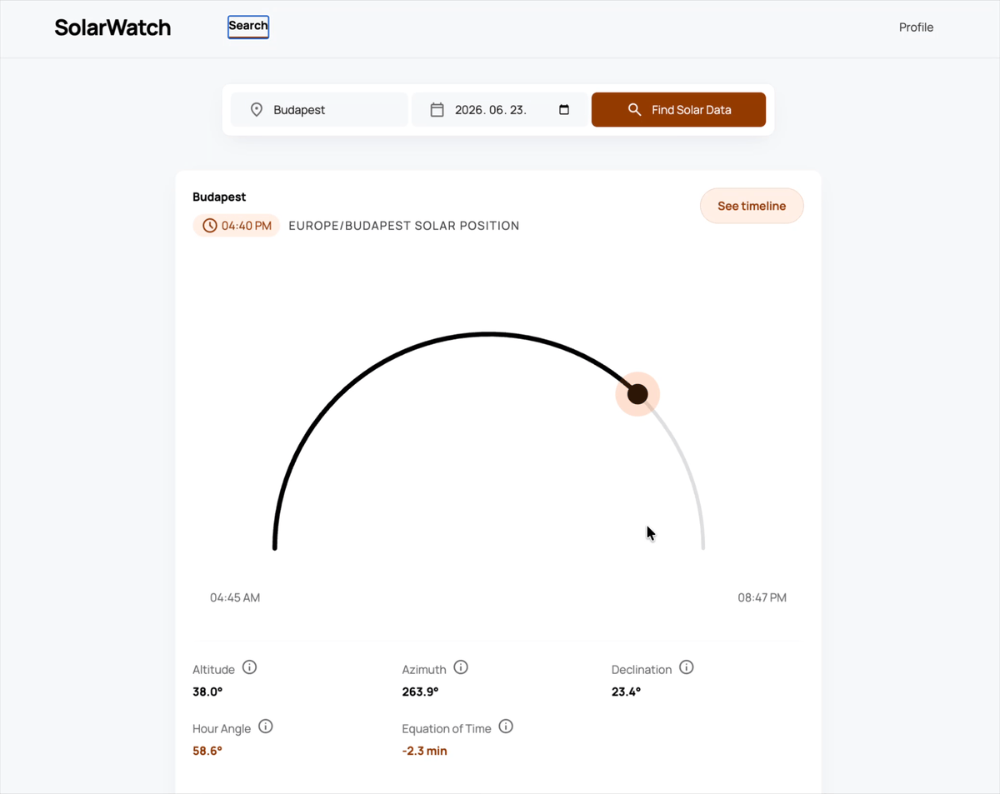

# SolarWatch

Look up sunrise and sunset times for any city on any date. Authenticate, search, and save your favorite locations — all in one place.



---

## Features

- Sunrise & sunset lookup by city and date
- User registration and JWT-based authentication (stored in HttpOnly cookies)
- City geocoding with results cached in the database
- Rate limiting — 100 req/min globally, 5 req/min on auth endpoints

---

## Tech Stack

### Backend
| | |
|---|---|
| Runtime | .NET 10 |
| Framework | ASP.NET Core Web API |
| ORM | Entity Framework Core 10 |
| Database | SQL Server |
| Auth | ASP.NET Core Identity + JWT Bearer |
| Docs | Swashbuckle / Swagger |

### Frontend
| | |
|---|---|
| Framework | React 19 + Vite |
| Routing | React Router v7 |
| Styling | Tailwind CSS v4 |

### External APIs
- [Open-Meteo Solar Position API](https://open-meteo.com/) — sunrise/sunset data
- [OpenStreetMap Nominatim](https://nominatim.openstreetmap.org/) — city geocoding
- [TimeZoneDB](https://timezonedb.com/) — timezone resolution

---

## Prerequisites

- [.NET 10 SDK](https://dotnet.microsoft.com/download)
- [Node.js 20+](https://nodejs.org/)
- SQL Server (local instance or Docker)
- A [TimeZoneDB API key](https://timezonedb.com/register) (free)

---

## Setup

### 1. Clone the repo

```bash
git clone https://github.com/CodecoolGlobal/solarwatch-api-csharp-vzsolt16-1852.git
cd solarwatch-api-csharp-vzsolt16-1852
```

### 2. Configure the backend

The backend uses [.NET User Secrets](https://learn.microsoft.com/en-us/aspnet/core/security/app-secrets) for sensitive values. From the `backend/SolarWatch` directory:

```bash
dotnet user-secrets set "ConnectionStrings:DefaultConnection" "Server=localhost;Database=SolarWatch;Trusted_Connection=True;TrustServerCertificate=True;"
dotnet user-secrets set "Jwt:IssuerSigningKey" "your-secret-key-min-32-chars"
dotnet user-secrets set "TimeZoneDb:ApiKey" "your-timezonedb-api-key"
```

### 3. Run database migrations

```bash
cd backend/SolarWatch
dotnet ef database update
```

### 4. Start the backend

```bash
dotnet run
```

The API runs at `https://localhost:7000` by default. Swagger UI is available at `/swagger`.

### 5. Start the frontend

```bash
cd frontend
npm install
npm run dev
```

The app runs at `http://localhost:5173`.

---

## Docker Compose

Run the entire application stack (SQL Server, Backend API, and Frontend) using Docker Compose from the project root:

```bash
docker compose up --build
```

- Frontend: `http://localhost:5173`
- Backend API: `http://localhost:8080` (Swagger: `http://localhost:8080/swagger`)
- SQL Server: `localhost:1434`

### Running containers individually

Backend:
```bash
cd backend/SolarWatch
docker build -t solarwatch-api .
docker run -p 8080:8080 \
  -e ConnectionStrings__DefaultConnection="..." \
  -e Jwt__IssuerSigningKey="..." \
  -e TimeZoneDb__ApiKey="..." \
  solarwatch-api
```

Frontend:
```bash
cd frontend
docker build -t solarwatch-frontend .
docker run -p 5173:80 solarwatch-frontend
```

---

## API Overview

| Method | Endpoint | Auth | Description |
|--------|----------|------|-------------|
| POST | `/api/auth/register` | — | Register a new user |
| POST | `/api/auth/login` | — | Log in, receive auth cookie |
| POST | `/api/auth/logout` | ✓ | Clear auth cookie |
| GET | `/api/solarwatch` | ✓ | Get sunrise/sunset for a city and date |
| GET | `/api/city` | ✓ | List cached cities |
| GET | `/api/profile` | ✓ | Get current user profile |

Full interactive docs available at `/swagger` when running in Development mode.

---

## Project Structure

```
├── backend/
│   └── SolarWatch/
│       ├── Controllers/     # API endpoints
│       ├── Data/            # EF Core DbContext & migrations
│       ├── Models/          # Entities & DTOs
│       └── Services/        # Business logic & external API clients
└── frontend/
    └── src/
        ├── components/
        └── pages/
```
